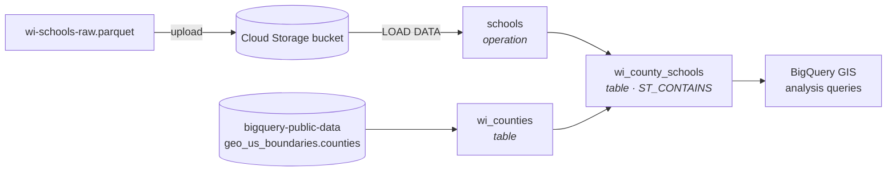

# GCP Geospatial Data Pipeline: GCS → Dataform → BigQuery

A cloud data pipeline on Google Cloud. Records for every Wisconsin school land in **Cloud Storage** as Parquet. A **Dataform** pipeline loads them into **BigQuery** and joins them with public U.S. county boundaries. **BigQuery GIS** queries then answer location questions, such as which high school is closest to each middle school.

## Architecture



The notebook runs on a GCP VM. It uploads the SQLX definitions to a Dataform workspace through the Dataform API, compiles the pipeline, reads back the action dependency graph, and queries the resulting tables with the BigQuery client.

## Pipeline definitions

| Action | Type | What it does |
| --- | --- | --- |
| [`schools`](definitions/schools.sqlx) | operation | `LOAD DATA OVERWRITE` from the Parquet file in GCS |
| [`wi_counties`](definitions/wi_counties.sqlx) | table | Wisconsin (FIPS 55) county polygons from BigQuery public data |
| [`wi_county_schools`](definitions/wi_county_schools.sqlx) | table | Builds `ST_GEOGPOINT` from each school's lat/long and assigns its county with `ST_CONTAINS` |

## Analysis

| Question | Technique | Result |
| --- | --- | --- |
| How many Wisconsin counties are there? | row count on `wi_counties` | 72 |
| How many public schools were matched to a county? | spatial join | 2,116 |
| Which counties have ≥ 2 cities with ≥ 3 public high schools? | BigQuery **pipe syntax** (`\|>`), two-level aggregation | Brown, Dane, Milwaukee, Waukesha |
| How many runs of that query fit in 1 TiB scanned? | `job.total_bytes_processed` | ~6.8 million |
| Closest public high school to each Dane County middle school | `ST_DISTANCE` + `MIN_BY` over a cross join | e.g. Badger Ridge Middle → Verona Area High |

## Tech stack

Google Cloud Storage · Dataform (SQLX) · BigQuery · BigQuery GIS · Compute Engine VM · Python (`google-cloud-bigquery`, `google-cloud-dataform`, PyArrow, pandas) · Jupyter

## Project structure

```text
GCP-BigQuery-Geospatial-Pipeline/
├── wi_schools_pipeline.ipynb   # upload → compile → query
├── definitions/                # Dataform SQLX actions (templated)
│   ├── schools.sqlx
│   ├── wi_counties.sqlx
│   └── wi_county_schools.sqlx
├── data/wi-schools-raw.parquet # raw school records
├── config.example.json         # copy to config.json
└── requirements.txt
```

## Running it

1. Create a GCS bucket and upload the data:
   ```bash
   gcloud storage buckets create gs://<your-bucket> --location=us-central1
   gcloud storage cp data/wi-schools-raw.parquet gs://<your-bucket>/
   ```
2. Create a BigQuery dataset, plus a Dataform repository with a workspace named `dev` in the same region.
3. Configure and run:
   ```bash
   cp config.example.json config.json   # set project, bucket, dataset, region, repository
   pip install -r requirements.txt
   jupyter lab wi_schools_pipeline.ipynb
   ```
4. After compiling, start a workflow invocation in the Dataform UI (or through the API) to materialize the tables before running the analysis cells.

The SQLX files use `__GCP_PROJECT__`, `__GCS_BUCKET__`, and `__DATASET__` placeholders. The notebook fills them in from `config.json` when it uploads the definitions.

Data: Wisconsin school directory data (public) and `bigquery-public-data.geo_us_boundaries`.
